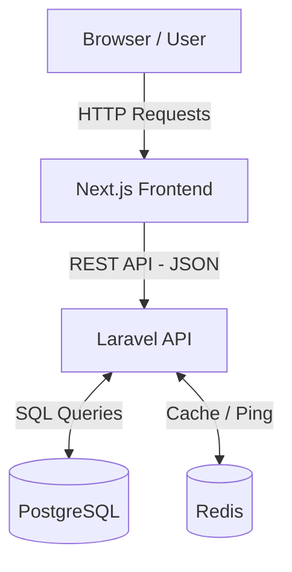
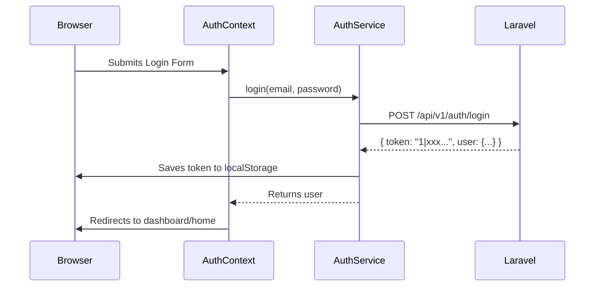
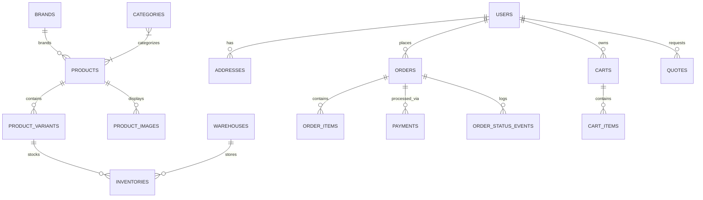
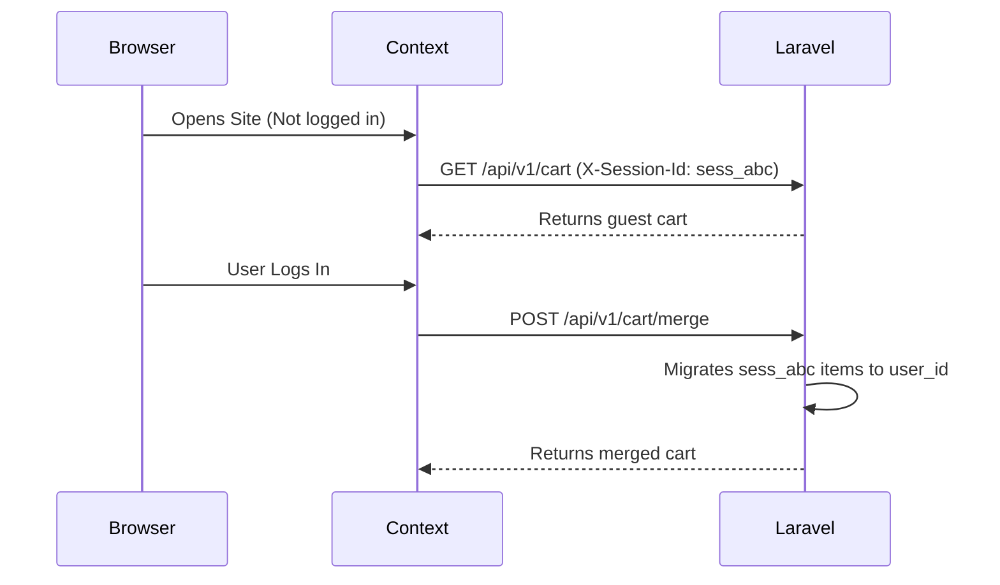

# Ayaan Platform — Complete Technical Architecture & Developer Documentation

## 1. Project Overview

The Ayaan Platform is an e-commerce ecosystem composed of a customer-facing storefront and a B2B/Admin management portal. The platform facilitates retail purchases, B2B wholesale orders (including Request for Quote (RFQ) workflows), and comprehensive store administration. 

The system relies on a modern decoupled architecture:
- **Frontend**: A Next.js application that handles both the public storefront and the authenticated admin portal.
- **Backend**: A Laravel API that manages business logic, PostgreSQL interactions, and Redis caching.

The application serves three primary user personas:
1. **Retail Customers**: Can browse products, add items to cart/wishlist, and checkout.
2. **B2B Buyers**: Can request quotes (RFQ) and access specialized payment terms (e.g., Net 30) if approved.
3. **Administrators**: Have complete control over inventory, product catalog, customer management, order fulfillment, and promotions.

## 2. Complete Tech Stack

| Technology | Version | Purpose | Where Used | Notes |
| ---------- | ------- | ------- | ---------- | ----- |
| **Next.js** | 16.3.2 | Frontend Framework | `src/` | Uses App Router |
| **React** | 19.2.8 | UI Library | `src/` | |
| **Tailwind CSS** | 4.3.3 | Styling | `src/` | Configured via PostCSS |
| **TypeScript** | 5.x | Type checking | `src/` | |
| **Lucide React** | 1.33.0 | Icon library | `src/` | |
| **PHP** | ^8.3 | Backend Language | `backend/` | |
| **Laravel** | ^13.17 | Backend Framework | `backend/` | Provides REST API |
| **Sanctum** | ^4.0 | Authentication | `backend/` | API token management |
| **PostgreSQL** | - | Primary Database | Database | Managed via Laravel migrations |
| **Redis** | - | Cache & Health | Infrastructure | Accessed via `predis/predis ^3.6` |

*Note: Versions are verified against `package.json` and `backend/composer.json`.*

## 3. High-Level Architecture

The platform uses a strict decoupled architecture. The Next.js frontend never accesses the PostgreSQL database directly. All communication is routed through versioned REST endpoints (`/api/v1/...`).



- **Authentication**: Managed via Laravel Sanctum. The frontend stores tokens in `localStorage` and includes them as Bearer tokens in API requests.
- **File Storage**: Handled by Laravel.
- **Admin**: The admin portal is seamlessly integrated into the Next.js frontend (`/admin`) and protected by role-based middleware on the backend.

## 4. Frontend Architecture

The frontend is structured around the Next.js App Router (`src/app`).

```text
src/
├── app/
│   ├── admin/       # Admin portal pages
│   ├── dashboard/   # User dashboard/orders
│   ├── login/       # Authentication
│   ├── signup/      # Registration
│   ├── products/    # Product listing & details
│   ├── profile/     # Customer profile management
│   ├── search/      # Search results
│   ├── rfq/         # Request for Quotation pages
│   └── layout.tsx   # Root layout
├── components/
│   ├── admin/       # Admin-specific UI components
│   ├── auth/        # Login/Signup forms
│   ├── cart/        # Cart drawer/modal (CheckoutModal, MiniCart)
│   ├── home/        # Landing page components
│   ├── layout/      # Navbar, Footer
│   ├── product/     # Product cards, detail views
│   └── ui/          # Shared reusable components
├── lib/
│   ├── AuthContext.tsx    # Authentication state
│   ├── CartContext.tsx    # Cart state & operations
│   ├── RfqContext.tsx     # B2B RFQ state
│   ├── WishlistContext.tsx# Wishlist state
│   └── formatters.ts      # USD currency formatters
├── services/
│   ├── api-client.ts      # Core fetch wrapper
│   ├── auth.service.ts    # Auth endpoints
│   ├── cart.service.ts    # Cart management
│   ├── order.service.ts   # Order endpoints
│   └── product.service.ts # Catalog endpoints
└── types/                 # TypeScript interfaces
```

## 5. Frontend Request Flow

All data mutations and fetches follow a unidirectional flow pattern. 

**Example Flow: Add to Cart (Guest or Authenticated)**
1. **User Action**: Clicks "Add to Cart" on a Product Component.
2. **Context**: Calls `addToCart` in `CartContext.tsx`.
3. **Service**: `CartContext` delegates to `cartService.addToCart(product, size, quantity)`.
4. **API Client**: `cartService` uses `apiClient.post('/cart')`.
5. **Request Headers**: `apiClient` attaches `X-Session-Id` (for guests) and `Authorization: Bearer <token>` (if logged in).
6. **Laravel Processing**: `CartController` updates the database (`carts` and `cart_items` tables).
7. **Response**: Laravel returns the updated cart JSON.
8. **State Update**: `CartContext` receives the JSON, updates React state, and triggers a re-render of the `MiniCart` component.

## 6. API Client Architecture

The frontend communicates with the backend exclusively via `src/services/api-client.ts`.

**Key Features:**
- **Base URL**: Reads from `NEXT_PUBLIC_API_URL` (defaults to `http://localhost:8000/api/v1`).
- **Token Management**: Intercepts tokens from `localStorage` (`ayaan_auth_token`).
- **Guest Sessions**: Generates and persists a unique `ayaan_session_id` in `localStorage` for anonymous cart tracking.
- **Headers**: Automatically injects `Accept: application/json`, `Authorization: Bearer`, and `X-Session-Id`.
- **Error Handling**: Catches HTTP 422 errors specifically. It maps Laravel's `.errors` object into a custom `ApiError` class, which components can catch to display validation warnings. Non-422 errors fall back to generic error messages based on the response payload.
## 7. Frontend Service Layer

All external API interactions are encapsulated in dedicated service classes located in `src/services/`.

| Service | Purpose | Main Methods | Endpoint(s) | Authentication |
| ------- | ------- | ------------ | ----------- | -------------- |
| **`auth.service.ts`** | Manages user lifecycle | `login`, `register`, `logout`, `getMe` | `/auth/login`, `/auth/register`, `/auth/me` | Required for `/me` |
| **`cart.service.ts`** | Cart operations | `getCart`, `addToCart`, `updateQuantity`, `removeFromCart`, `mergeGuestCart` | `/cart`, `/cart/items`, `/cart/merge` | Supports both Token and Session-Id |
| **`order.service.ts`** | Order management | `createOrder`, `getOrders`, `getOrderDetails`, `cancelOrder`, `uploadPaymentProof` | `/orders` | Required (Throttle: 60/min for creation) |
| **`product.service.ts`**| Catalog browsing | `getProducts`, `getProduct` | `/products` | None (Admin endpoints are separate) |
| **`rfq.service.ts`** | B2B Quotes | `submitRfq`, `getRfqs`, `getRfqDetails` | `/rfq` | Required to view/list |
| **`wishlist.service.ts`**| Wishlist operations | `getWishlist`, `addToWishlist`, `removeFromWishlist` | `/wishlist` | Required |

## 8. Frontend State Management

The application state is primarily managed via React Context.

- **`AuthContext.tsx`**: Owns the authenticated `user` object. Updates on login/logout or page refresh by calling `/auth/me`. 
- **`CartContext.tsx`**: Source of truth for the cart. Fetches on load and maintains `totalItems`, `subtotal`, and `items`. Contains a dedicated `mergeGuestCart` hook that triggers when `user` becomes populated from `AuthContext`.
- **`WishlistContext.tsx`**: Owns user's wishlist state.
- **`RfqContext.tsx`**: Tracks B2B RFQ creation state.
- **`PreferencesContext.tsx`**: Tracks UI preferences (e.g., currency defaults if implemented, themes).

**Persistence**: 
- **Authentication**: `ayaan_auth_token` (localStorage).
- **Guest Session**: `ayaan_session_id` (localStorage).
The actual authoritative data (cart items, wishlist items) lives on the server and is fetched into memory via these contexts.

## 9. Authentication Architecture

Authentication uses Laravel Sanctum for API token generation.



- **Tokens**: Personal Access Tokens (PATs) are issued on login and destroyed on `/auth/logout`.
- **Session Preservation**: Upon page reload, `AuthContext` mounts, reads the token from `localStorage`, and calls `GET /api/v1/auth/me`. If it receives a 401, it purges the token and logs the user out.
- **Protection**: Private Next.js routes (like `/dashboard` and `/admin`) are protected by checking the `user` state and redirecting to `/login` if unauthenticated.

## 10. Authorization & Roles

The system uses a strict role-based access control (RBAC) mechanism.

**Roles Implemented:**
- `customer`: Default role. Can purchase products, view their own orders.
- `b2b_buyer`: Wholesale buyer. Can submit RFQs, potentially utilize "Net 30" terms based on `b2b_approval_status`.
- `admin`: Super user. Has access to all `/api/v1/admin/*` endpoints.

**Backend Enforcement:**
Backend routes are protected by the `role:admin` middleware (e.g., `Route::middleware(['auth:sanctum', 'role:admin'])`). Resource ownership (e.g., ensuring a customer only sees their own orders) is enforced inside the controller logic using `$request->user()->id`.

**Frontend Enforcement:**
The frontend checks `user.role === 'admin'` before rendering admin links, but the true security boundary remains on the API.

## 11. Database Architecture

The PostgreSQL database relies heavily on relational integrity. 



**Key Entities:**
- `users`: Stores core identity, roles, and B2B specific fields (`company_name`, `tax_id`, `b2b_payment_terms`, `b2b_credit_limit`).
- `products`: Base catalog items. Contains `wholesale_price`, `msrp_price`, `cost_price`.
- `product_variants`: Actual purchasable SKUs (Size, Color). Contains its own `price` and `compare_at_price`.
- `inventories`: Tracks `quantity` and `reserved_quantity` per `product_variant_id` and `warehouse_id`.
- `orders` & `order_items`: Snapshots of historical purchases.
- `quotes` & `quote_items`: Tracks RFQs requested by B2B buyers.

## 12. Product Domain

The catalog is split into base **Products** and **Product Variants**. 
- A **Product** represents a marketing entity (e.g., "Ayaan Signature Hoodie") containing global descriptions, default pricing, and brand assignments.
- A **Variant** represents the physical item a customer buys (e.g., "Size: L, Color: Black"), carrying a unique SKU, localized pricing, and specific stock levels.

**Currency / Pricing:**
The application is **USD-Only**. Prices are stored as `decimal:2` in the database. 
- There is no currency conversion logic. 
- A product has fields for `wholesale_price` (for B2B), `msrp_price` (marketing), and `cost_price` (internal tracking).

**Product Discovery:**
- Endpoints like `GET /api/v1/products` accept pagination and filtering parameters. 
- Relationships (like `Brand` and `Category`) are managed via foreign keys and pivot tables (`category_product`).
## 13. Cart Architecture

The platform supports both **Guest** and **Authenticated** carts.

- **Guest Cart**: Tracked via `X-Session-Id` header (generated and stored in `localStorage` as `ayaan_session_id`).
- **Authenticated Cart**: Tracked via `user_id` when the `Authorization` header is present.

**Cart Merge Flow:**
When a user logs in, `CartContext` triggers `cartService.mergeGuestCart()`. The backend takes any items assigned to the current `session_id` and migrates them to the `user_id`, handling duplicate resolution.



## 14. Checkout Architecture

The checkout process is entirely backend-authoritative. The frontend (`CheckoutModal.tsx`) collects user information (address, payment method) and submits it to `POST /api/v1/orders`.

**Server-Side Order Creation (`OrderController@store`):**
1. **Cart Resolution**: The server reads the active cart (via token or session ID) or accepts a direct array of items in the request.
2. **Transaction**: Wraps the entire operation in a `DB::transaction`.
3. **Validation & Locking**: Loops through items, validates product availability, and uses `lockForUpdate()` on the `ProductVariant` row to prevent concurrent overselling race conditions.
4. **MOQ Enforcement**: If the user is B2B, server enforces the `moq` rule.
5. **Authoritative Pricing**: The frontend price is completely ignored. The backend calculates `unit_price` based on role (B2B wholesale vs MSRP).
6. **Stock Deduction**: Decrements `stock` on the variant immediately.
7. **Order Records**: Creates `Order`, `OrderItem`, `Payment`, and `OrderStatusEvent` records.
8. **Cart Clearing**: Deletes the active cart items.

## 15. Order System

Orders act as immutable snapshots of a purchase.

- `Order`: Contains totals, shipping info, and current state.
- `OrderItem`: Stores a snapshot of `unit_price`, `product_name`, etc. so historical orders aren't affected by catalog changes.
- `OrderStatusEvent`: A timeline of the order (e.g., "Order placed", "Payment processed").

**Status Lifecycles:**
- **Order Status**: `pending` → `processing` → `cancelled` (or fulfilled statuses if added).
- **Payment Status**: `pending` → `succeeded`
- **Fulfillment Status**: `unfulfilled` → (can be updated by admin).

**Cancellations**:
Users can cancel their own orders (if not shipped). The backend `cancel()` method automatically restores the variant `stock`.

## 16. Payment Architecture

Payments are handled dynamically based on the selected method.

1. **Card Payments**: Mapped locally as `provider: 'card'`. Set to `succeeded` automatically in the demo flow, updating the order to `processing`.
2. **B2B Payment Terms**: E.g., `net_30`. The server strictly verifies if the user `isB2bBuyer()`, is `approved`, and has `net_30` assigned in `b2b_payment_terms` before allowing this. If valid, order becomes `processing`.
3. **Manual Proofs**: Users can upload payment receipts (`POST /orders/{id}/payment-proof`), storing the file publicly in Laravel `storage` and logging a timeline event.

## 17. Inventory Architecture

Inventory exists in two levels of complexity depending on the model, but the authoritative point of sale deduction currently happens at the **Variant** level.

- `ProductVariant` model contains a flat `stock` integer.
- `Inventory` model supports multi-warehouse logic (`quantity`, `reserved_quantity`, `warehouse_id`).

*Crucial Developer Note:* The `OrderController@store` transaction directly decrements `ProductVariant->stock`. If expanding to multi-warehouse fulfillment, this controller must be updated to deduct from specific `Inventory` rows instead.

## 18. B2B Architecture

B2B functionality is deeply integrated rather than bolted on.

**B2B Identity**:
A user is B2B if `role === 'b2b_buyer'`. They require `b2b_approval_status === 'approved'` to utilize features.

**B2B Features:**
- **Pricing**: B2B users automatically receive `wholesale_price` during checkout calculations.
- **MOQ (Minimum Order Quantity)**: Enforced server-side.
- **Payment Terms**: Commercial credit (Net 30/60) is allowed if `b2b_payment_terms` is configured by an admin.
- **RFQ (Request for Quote)**: Buyers can submit custom quotes via `POST /api/v1/rfq`, creating `quotes` and `quote_items` instead of direct orders.

## 19. Admin Architecture

The admin portal is a React application served within the Next.js `src/app/admin` route.

**Security:**
Hiding the UI link is not security. All backend admin endpoints (`/api/v1/admin/*`) are protected by the `role:admin` middleware. If a customer attempts to call `GET /api/v1/admin/customers`, Laravel will return a `403 Forbidden`.

**Admin Capabilities:**
- **Dashboard**: `AdminDashboardController` provides metrics.
- **Inventory**: `AdminInventoryController` handles stock adjustments across warehouses.
- **Customers**: View and modify customer profiles (crucial for approving B2B buyers and setting credit limits).
- **Orders**: Admins can update `status` and `fulfillment_status`, and review uploaded payment proofs.
- **Promotions/Coupons**: CRUD operations via API Resources.
- **Catalog**: Managed via the main `ProductController` (admin `POST/PUT/DELETE` methods).
## 20. File Storage

File uploads are handled natively via Laravel's `Storage` facade utilizing the `public` disk (which translates to `storage/app/public`).

**Example: Payment Proofs**
- **Endpoint**: `POST /api/v1/orders/{id}/payment-proof`
- **Validation**: Strict MIME checks (`mimes:jpg,jpeg,png,webp,pdf`) and size limits (`max:10240` - 10MB).
- **Storage**: Saved to `order-receipts/` directory.
- **Accessibility**: A public URL is generated using `asset('storage/...')` and stored in the database.

*Note for junior developers:* Always ensure `php artisan storage:link` has been executed in the local and production environments, otherwise images will return 404s.

## 21. Error Handling & Validation Architecture

Laravel handles validation using dedicated `FormRequest` classes located in `app/Http/Requests/`. 

**Common Form Requests:**
- `RegisterRequest`, `LoginRequest`
- `CreateOrderRequest`
- `AddCartItemRequest`

**Flow:**
1. Next.js sends a POST request with invalid/missing data.
2. Laravel intercepts it via the `FormRequest`.
3. Laravel throws a `ValidationException`, which the framework converts into an **HTTP 422 Unprocessable Entity** JSON response.
4. The payload looks like: `{"message": "...", "errors": {"email": ["The email field is required."]}}`.
5. The Next.js `apiClient` catches the 422, extracts the `.errors` object, and throws a custom `ApiError`.
6. React components catch `ApiError` and map `.errors` to UI form validation states.

**HTTP Status Codes Used:**
- `200 OK` / `201 Created`: Success
- `400 Bad Request`: General logic errors
- `401 Unauthorized`: Missing or invalid Sanctum token
- `403 Forbidden`: Authenticated, but lacks role or ownership
- `404 Not Found`: Resource does not exist
- `422 Unprocessable Entity`: Validation failure
- `429 Too Many Requests`: Rate limiting (Throttle middleware)

## 22. Security Architecture

The application relies on multiple layers of security.

**Implemented Controls:**
- **Sanctum Authentication**: Token-based API security. No session cookies, eliminating CSRF vulnerabilities for cross-origin API calls.
- **Role Middleware**: Endpoints are explicitly locked to roles.
- **Ownership Checks**: Controllers manually verify `$order->user_id === $request->user()->id`.
- **Database Transactions & Locking**: Checkout utilizes `DB::transaction()` and `lockForUpdate()` to prevent race conditions during inventory decrement.
- **Mass Assignment Protection**: Eloquent models strictly define `$fillable` arrays.
- **Rate Limiting**: Auth routes (`/login`, `/register`) use `throttle:10,1`. Orders use `throttle:60,1`.

**Not Implemented / Trust Boundaries:**
- The frontend is **never trusted**. The frontend cart total, calculated taxes, and roles are purely cosmetic. The backend recalculates all pricing from the database.
- Payment Webhooks (`/api/v1/payments/webhook`) must implement HMAC signature verification depending on the provider chosen (Stripe, etc.).

## 23. Local Development Guide

To get a junior developer up and running from scratch:

**Prerequisites:** Node.js, PHP 8.3+, Composer, PostgreSQL, Redis.

**Backend Setup:**
1. `cd backend`
2. `composer install`
3. `cp .env.example .env` (Configure DB & Redis credentials)
4. `php artisan key:generate`
5. `php artisan migrate:fresh --seed` (Do not run in production!)
6. `php artisan storage:link`
7. `php artisan serve` (Starts on localhost:8000)

**Frontend Setup:**
1. `cd src` (or project root)
2. `npm install`
3. Ensure `.env.local` has `NEXT_PUBLIC_API_URL=http://localhost:8000/api/v1`
4. `npm run dev` (Starts Next.js on localhost:3000)

## 24. Code Ownership Map

When modifying a feature, touch these files:

| Feature | Frontend Entry Point | Frontend Service | Backend Controller | Model | Migration |
| ------- | -------------------- | ---------------- | ------------------ | ----- | --------- |
| **Auth** | `src/app/login/page.tsx` | `auth.service.ts` | `AuthController` | `User` | `create_users_table` |
| **Cart** | `src/components/cart/*` | `cart.service.ts` | `CartController` | `Cart` | `create_carts_table` |
| **Checkout**| `CheckoutModal.tsx` | `order.service.ts` | `OrderController` | `Order` | `create_orders_table` |
| **Catalog** | `src/app/products/*` | `product.service.ts` | `ProductController`| `Product` | `create_products_table` |

## 25. Debugging Guide

**"The API returns 401 when I try to checkout"**
- **Check**: Browser Application tab. Is `ayaan_auth_token` present in `localStorage`?
- **Check**: Network tab. Is the `Authorization: Bearer <token>` header being sent?
- **Check**: Backend. Is the token expired or deleted from the `personal_access_tokens` table?

**"Stock is not decrementing"**
- **Check**: `OrderController@store`. Is the `$variant_model->decrement()` logic executing?
- **Check**: Did you pass a `variant_id`? If not, is it falling back to the base product without deducting stock correctly?

**"Admin page shows 403 Forbidden"**
- **Check**: Your user role. In PostgreSQL, ensure `role` is set to `admin`. Hiding the UI link in Next.js does not grant you backend access.

## 26. Architectural Decision Records (ADR)

1. **Decoupled Architecture**: Next.js + Laravel was chosen over a monolith (like Laravel Blade) to support rich interactive client states (complex cart drawers, dynamic filters) while maintaining a strict API boundary for future mobile apps.
2. **Server-Authoritative Pricing**: The frontend is treated as completely untrustworthy. It displays prices, but the checkout payload only sends IDs and quantities. The backend calculates the final total based on B2B rules and database MSRO/Wholesale values.
3. **Historical Order Snapshots**: `OrderItem` copies the `unit_price`, `product_name`, and `sku` from the product at the time of purchase. This ensures past orders don't magically change price if an admin updates the catalog.

## 27. Known Limitations

- **Multi-Currency**: The system is hardcoded to USD. Adding multi-currency requires database schema changes.
- **Search**: Search is currently basic relational filtering. For high scale, it may need to be offloaded to Elasticsearch, Meilisearch, or Algolia.
- **Background Jobs**: Currently, order notifications and heavy tasks are executed synchronously. As scale increases, Laravel Queues (`ShouldQueue`) and a worker process will be required.

## 28. Safe Development Rules

- **Never** access PostgreSQL directly from Next.js.
- **Never** trust frontend prices.
- **Never** decrement stock manually without using a database transaction.
- **Always** create a Laravel `FormRequest` for new POST/PUT endpoints.
- **Always** reuse `apiClient` in the frontend; do not write raw `fetch` calls.
